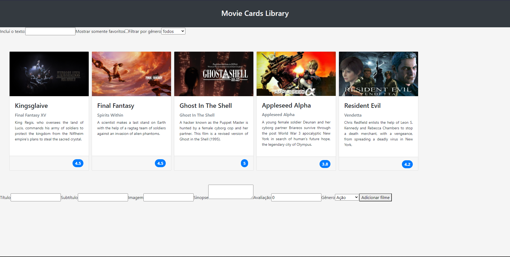

<h1 align="center">MovieCards</h1>

Link para a aplicação: https://pauloeduardods.github.io/MovieCards/

Projeto consistia em fazer uma aplicação em React de um app para escolher filmes

## Aprendizados
 * React

<h2 align="center">Como rodar o projeto</h2>

### No terminal
1. Clonar o projeto `git clone git@github.com:pauloeduardods/MovieCards.git`
2. Entrar no diretório `cd MovieCards`
3. Instalar as dependências `npm install`
4. Rodar a aplicação `npm start`
5. Acessar a aplicação `http://localhost:3000`

## Tecnologias
* React

## Status

Finalizado
